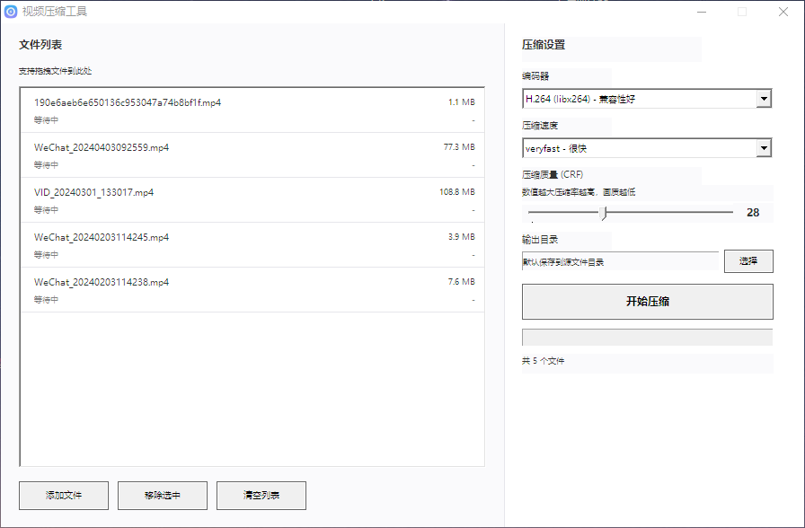

# 极简视频压缩工具 · Video Compressor

<div align="center">

一款基于 **Win32** 与 **FFmpeg** 的 Windows 桌面视频批量压缩小工具，体积小、启动快，适合日常转码与体积优化。

[功能特性](#功能特性) · [界面预览](#界面预览) · [打赏支持](#打赏支持) · [使用说明](#使用说明) · [构建编译](#构建编译)

</div>

---

## 简介

本工具使用原生 Windows 界面（C + Win32），通过调用 `ffmpeg` / `ffprobe` 完成 **H.264 / H.265** 编码、**CRF** 质量与 **preset** 速度调节，支持批量队列、自定义输出目录与拖拽添加文件。

> **English**: A lightweight Windows video batch compressor using Win32 UI and FFmpeg CLI (H.264/H.265, CRF, presets). Requires `ffmpeg.exe` and `ffprobe.exe` alongside the executable.

---

## 功能特性

- 批量添加视频（对话框多选 / 拖拽）
- 编码器：**H.264 (libx264)** / **H.265 (libx265)**
- **CRF** 质量调节（18–51）与 **preset** 压缩速度
- 可选输出目录；默认可保存至源文件所在目录
- 列表显示文件名、状态、源文件大小与压缩率
- 整体进度与单文件状态反馈

---

## 界面预览

<p align="center">
  
</p>

<p align="center"><sub>主界面截图（素材：<code>assets/screen.png</code>）</sub></p>

---

## 打赏支持

如果这个项目对你有帮助，欢迎扫码支持后续维护与改进。

<p align="center">
  
</p>

---

## 使用说明

### 环境要求

1. **Windows**（建议 Windows 10 及以上）
2. 将 **`ffmpeg.exe`** 与 **`ffprobe.exe`** 放在本程序**同一目录**，或加入系统 **PATH**（程序按当前工作目录调用命令名）

可从 [FFmpeg 官方构建](https://www.gyan.dev/ffmpeg/builds/) 或 [BtbN FFmpeg Builds](https://github.com/BtbN/FFmpeg-Builds/releases) 获取 Windows 版本。

### 操作步骤

1. 运行编译得到的 `video-compressor.exe`（或你自定义的输出文件名）
2. 点击 **添加文件** 或将视频 **拖入窗口**
3. 选择 **编码器**、**压缩速度**、调节 **CRF**
4. 可选：点击 **选择** 指定 **输出目录**
5. 点击 **开始压缩**，等待队列处理完成

### 输出文件命名

- H.264：`原文件名_h264.mp4`
- H.265：`原文件名_h265.mp4`

---

## 构建编译

### 前置条件

- **MinGW-w64** / **TDM-GCC** 等带 `gcc` 的环境  
- **`windres`**（用于编译 `resource.rc` 中的图标与清单）  
- 可选：**UPX** 压缩体积

### MinGW 示例

在项目根目录执行：

```bash
windres resource.rc -o resource.o
gcc -O2 -s -mwindows video_compressor.c resource.o -o video-compressor.exe ^
  -lcomctl32 -lcomdlg32 -lshell32 -luser32 -lgdi32 -lole32
```

> 若 `resource.rc` 中引用了 `ldstore.ico`，请确保该图标文件与 `resource.rc` 同目录，或修改 `rc` 中的路径后再编译。

### 可选：UPX 压缩

```bash
upx --best --lzma video-compressor.exe
```

---

## 项目结构

```
.
├── video_compressor.c   # 主程序源码
├── resource.rc          # 图标与应用程序清单
├── manifest.xml         # UAC / DPI 等清单配置
├── assets/
│   ├── screen.png       # README 界面截图
│   └── pay.png          # 打赏二维码
└── README.md
```

---

## 开源与许可

若你对外发布仓库，可自行补充 **License** 文件（例如 MIT）。未附带许可证时，默认保留所有权利；建议在仓库根目录添加 `LICENSE`。

---


<div align="center">

**Made with Win32 + FFmpeg**

</div>
